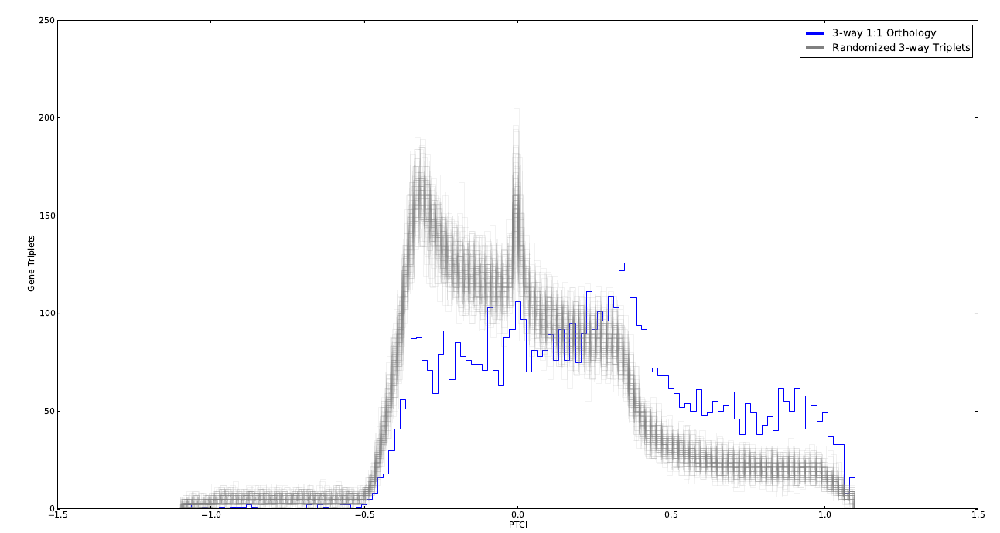
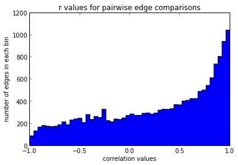
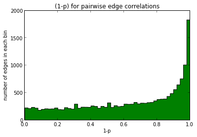
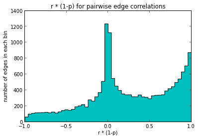
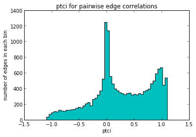
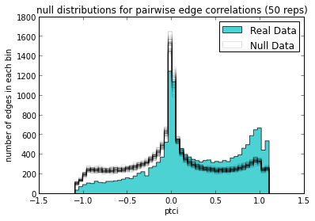
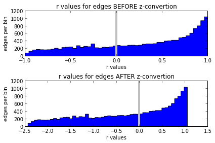

Exploring Various ways to combine transcription profile correlation (*r*), confidence in that correlation (*p value* associated with *r*), and phylogenetic distance (*w(d)*) between species into a useful PTC index (Phylogenetic Transcription Conservation Index)
=====================================================================================================================================================================================================================================================================

Original solution
-----------------

:math:`PTCI = r \cdot (1-p) \cdot w(d)`

Xiaohui objected that *1-p* is not optimal because the *1-p* will likely
have a distribution skewed toward *1*. He suggested loging the variable,
among other options (see below).

Original Results
~~~~~~~~~~~~~~~~

This is a histogram of the three way mean PTCIs using the original
solution. Blue=Real data. Grey=Randomizations that abolish the three way
orthology relationships. The 'Null' distribution [grey] is significantly
different from the real data [blue] but has significant structure that
is not what one would predict (resemble a normal dist). Notably, there is
a large concentration around -0.5 that I can not explain.

.. more::

Suggested alterations
~~~~~~~~~~~~~~~~~~~~~

1. log the 1-p value
2. convert to Z scores

   -  not sure exactly what he meant here
   -  \*\ :math:`z(r) \cdot (1-p) \cdot w(d)`
   -  :math:`r \cdot z(1-p) \cdot w(d)`
   -  :math:`z(r) \cdot z(1-p) \cdot w(d)`
   -  :math:`z(r \cdot (1-p)) \cdot w(d)`

3. 'fiddle' with it till the null distribution makes sense...

Distributions of *r* and *1-p*
~~~~~~~~~~~~~~~~~~~~~~~~~~~~~~

I will now plot the distributions of the separate variables in the PTCI
to determine if they help explain the structure seen above.

In[1]:

.. code:: python

    # run gfunc_build_n_way_one2one script and capture output in variable 'trap'
    # NOTE: for syntax highlighting to work on this blog post, I had to comment out the ipython magic command below:
   
    # %run -i gfunc_build_n_way_one2one.py gfunc/Aa_Ag_Cq_sort_pci.conf
    
    graphHandler,graphBuilder,n_way_ortho_table,ortho_parser = trap
    
    # extract edge data from the graphs
    edges = graphHandler.edge_dict.values() 
    
    
    # save original graphHandler in case we alter it and then want to use the original later
    from copy import deepcopy
    original_graphHandler =  deepcopy(graphHandler)

.. parsed-literal::

    bestChoose is 'comb' from 'gmpy'.
    main() completed.

    

Here I define a function '``edge_correlation()``' to calculate and return *r* and its *p*
^^^^^^^^^^^^^^^^^^^^^^^^^^^^^^^^^^^^^^^^^^^^^^^^^^^^^^^^^^^^^^^^^^^^^^^^^^^^^^^^^^^^^^^^^^^

In[2]:

.. code:: python

    from scipy import stats as sp_stats
    
    def edge_correlation(gFunc_edge):
        """
        Returns the pearson r value and corresponding p-value
        for a given edge's nodes.
        """
        node1,node2 = gFunc_edge.nodes
        try:
            r_val,p_val = sp_stats.pearsonr(node1.data.expression_vector, node2.data.expression_vector)
            if np.isnan(r_val):
                pass
            else:
                return r_val,p_val
        
        except AttributeError as err:
            if """'Bunch' object has no attribute""" in err.message:
                # if this executes then one of the nodes did not have an expression_vector which means no r is possible
                # in this case return None
                return None
            else:
                # if this executes then something ELSE went wrong: thus I will fail.
                raise err

In[3]:

.. code:: python

    # collect all the results using edge_correlation()
    edge_r_and_p_values = [edge_correlation(edge) for edge in edges]
    
    # get rid of any results that equal None
    edge_r_and_p_values = [x for x in edge_r_and_p_values if x != None]

Now we plot a histogram of the r values
^^^^^^^^^^^^^^^^^^^^^^^^^^^^^^^^^^^^^^^

In[4]:

.. code:: python

    r_values = [edge_r_and_p_values[i][0] for i in range(len(edge_r_and_p_values))]
    
    hist(r_values,bins=50,histtype='stepfilled',cumulative=False, color='b')
    xlabel('correlation values')
    ylabel('number of edges in each bin')
    title('r values for pairwise edge comparisons')

Out[4]:

.. parsed-literal::

    <matplotlib.text.Text at 0x3861e950>

And now of the (1 - p\_values)
^^^^^^^^^^^^^^^^^^^^^^^^^^^^^^

In[5]:

.. code:: python

    p_values = [edge_r_and_p_values[i][1] for i in range(len(edge_r_and_p_values))]
    one_minus_pvals = [(1-p) for p in p_values]
    hist(one_minus_pvals,bins=50,histtype='stepfilled',cumulative=False, color='g')
    xlabel('1-p')
    ylabel('number of edges in each bin')
    title('(1-p) for pairwise edge correlations')

Out[5]:

.. parsed-literal::

    <matplotlib.text.Text at 0x3ac69b50>

Now the combined :math:`r \cdot (1-p)`
^^^^^^^^^^^^^^^^^^^^^^^^^^^^^^^^^^^^^^

In[6]:

.. code:: python

    r_by_1minusP = [r_values[i] * (1 - p_values[i]) for i in range(len(r_values))]
    hist(r_by_1minusP,bins=50,histtype='stepfilled',cumulative=False, color='c')
    xlabel('r * (1-p)')
    ylabel('number of edges in each bin')
    title('r * (1-p) for pairwise edge correlations')

Out[6]:

.. parsed-literal::

    <matplotlib.text.Text at 0x40ea4090>

In[7]:

.. code:: python

    hist2d(r_values,p_values,bins=25)
    colorbar()
    xlabel("r values")
    ylabel("p-values")
    title('2D histogram of r and p-value pairs')

Out[7]:

.. parsed-literal::

    <matplotlib.text.Text at 0x3862f1d0>

.. image:: Exploring_PTCI_files/Exploring_PTCI_fig_03.png

The 2D histogram above shows that as expected the p-values track mostly
but not completely with the r values. Generally, a more extreme r value
will also come with a "better" p-value, but this is not absolute which
warrants keeping the p-value variable in the PTCI in some capacity.
Also, this plot illustrates that the most populated bins are those with
positive r values close to +1.

Now the full PTCI
^^^^^^^^^^^^^^^^^

In[8]:

.. code:: python

    # define function to calculate the PTCI
    from gfunc.maths import weight_d_for_ptci as scale_the_d
    
    def calc_ptci(gFunc_edge):
        """
        calculate the PTCI
        """
        try:
            r_val,p_val = edge_correlation(gFunc_edge)
            
            d_val,d_min,d_max = gFunc_edge.data.divergence
            
            ptci = r_val * (1-p_val) * scale_the_d(d_val,d_min,d_max)
            
            if not np.isnan(ptci):
                # If we get a valid ptci store the value in the gFunc_edge object and also return it
                gFunc_edge.data.PTCI = ptci
                return ptci
            else:
                # If we get an invalid ptci, store it and return it as None
                gFunc_edge.data.PTCI = None
                return None
        except TypeError as err:
            if str(err) == "'NoneType' object is not iterable":
                # If we get an invalid ptci, store it and return it as None
                gFunc_edge.data.PTCI = None
                return None
            else:
                raise

In[9]:

.. code:: python

    pairwise_ptci_vals = [calc_ptci(edge) for edge in edges]
    
    # remove any None values
    pairwise_ptci_vals = [ptci for ptci in pairwise_ptci_vals if ptci != None]

In[10]:

.. code:: python

    hist(pairwise_ptci_vals,bins=50,histtype='stepfilled',cumulative=False, color='c')
    xlabel('ptci')
    ylabel('number of edges in each bin')
    title('ptci for pairwise edge correlations')

Out[10]:

.. parsed-literal::

    <matplotlib.text.Text at 0x476b5110>

Explore Null distributions for pairwise edge relationships (randomized orthology assignments)
---------------------------------------------------------------------------------------------

Generate the Null distributions
~~~~~~~~~~~~~~~~~~~~~~~~~~~~~~~

In[11]:

.. code:: python

    # import edge randomizer function
    from gfunc.scripts.gfunc_build_n_way_one2one import reset_random_edges
    
    # Scramble the edges many times and collect the pairwise ptci distributions
    
    reps = 50
    
    null_paired_ptci_distributions = []
    
    for rep in range(reps):
        # scramble edges for this rep and set new r&p vals
        reset_random_edges(graphHandler,graphBuilder,n_way_ortho_table,ortho_parser)
        graphHandler.measure_relations()
        
        # calculate null ptci vals
        null_edges = graphHandler.edge_dict.values()
        null_pairwise_ptci_vals = [calc_ptci(edge) for edge in null_edges]
    
        # remove any None values
        null_pairwise_ptci_vals = [ptci for ptci in null_pairwise_ptci_vals if ptci != None]
        
        # collect null ptci distribution
        null_paired_ptci_distributions.append(null_pairwise_ptci_vals)

Graph the Null distributions
~~~~~~~~~~~~~~~~~~~~~~~~~~~~

In[12]:

.. code:: python

    # Show what the actual data looks like for comparison
    hist(pairwise_ptci_vals,bins=50,histtype='stepfilled',cumulative=False, color='c',alpha=.7, label='Real Data')
    
    # Graph null distributions as grey slightly transparent histograms
    null_label = 'Null Data'
    
    for null_dist in null_paired_ptci_distributions:
        hist(null_dist,bins=50,histtype='step',cumulative=False, color='k',alpha=.1,label=null_label)
        null_label = None
    
    
    
    
    xlabel('ptci')
    ylabel('number of edges in each bin')
    title('null distributions for pairwise edge correlations (%s reps)' % (reps))
    legend()
    
    

Out[12]:

.. parsed-literal::

    <matplotlib.legend.Legend at 0x35fad690>

Observations and Discussions:
~~~~~~~~~~~~~~~~~~~~~~~~~~~~~

1. The structure of the null distributions in the pairwise cases are
   what I would have predicted

   -  most pairs show no correlation
   -  there is no bias in either the strong negative or strong positive
      correlation zones (near -1 or +1)

2. [ **QUESTION:** ] It seems that the PTCI math itself is not the
   ultimate cause of the strange structure found in the null
   distributions of the 3-way comparisons at the start of this document.

3. [ **QUESTION:** ] This seems to negate the need to use z-score
   conversions on any of the PTCI variables??

   -  **ACTUALLY:** this is not totally true, although it will might
      **not** fix the shape problem, as the z-score distributions will
      all have the same "shape" as the un-converted distributions
   -  **BUT:** since the z-score distributions are x-shifted so that "0"
      lies at the mean (*or alternately: median if I wanted to do it
      that way*), z-converting the **r values** may still be a good way
      to highlight those pairs that are most likely to be positively
      correlated? (see figure below)

4. [ **QUESTION:** ] Would this also suggest that the **shape** of the
   p-value distribution is not a primary problem either (that taking the
   log of the p-values would not help the shape of the 3-way null
   distributions)

5. [ **PROPOSITION:** ] Perhaps I made a mistake in the way that I
   calculated the mean 3-way PTCI values for the null distributions?

6. [ **PROPOSITION:** ] Perhaps I should exclude any mean PTCI info from
   a 3-way ortholog triplicate if any pairwise PTCI is missing (usualy
   due to one of the orthologs being undetected). Currently, if one
   ortholog expression vector is missing (undetected) I simply take the
   mean of the remaining two pairwise comparisons. Maybe this is
   introducing strange structural elements in the distribution depending
   on which species is missing data?

   -  I **thought** that the branch length data should correct this but
      maybe not?

In[13]:

.. code:: python

    def convert_to_z_scores(data_vector):
        vec_mean = mean(data_vector)
        vec_median = median(data_vector)
        vec_stdev = std(data_vector)
        
        z_vector = (data_vector - vec_median) / (vec_stdev)
        return z_vector

In[14]:

.. code:: python

    z_r_values = convert_to_z_scores(r_values)
    
    
    subplot(211)
    
    vert_line_color = '0.75'
    
    hist(r_values,bins=50,histtype='stepfilled',cumulative=False, color='b')
    axvline(linewidth=4, color=vert_line_color)
    xlabel('r values')
    ylabel('edges per bin')
    title('r values for edges BEFORE z-convertion')
    
    subplot(212)
    hist(z_r_values,bins=50,histtype='stepfilled',cumulative=False, color='b')
    axvline(linewidth=4, color=vert_line_color)
    xlabel('r values')
    ylabel('edges per bin')
    title('r values for edges AFTER z-convertion')
    
    tight_layout()

Next Actions:
~~~~~~~~~~~~~

1. Re try calculating the 3-way null distributions: using new code or
   code from this notebook rather than gFunc code to see if I simply
   made a mistake.
2. Replot pairwise distribution using z-converted r values.

    
    
    

.. author:: default
.. categories:: none
.. tags:: open science, research, ipython
.. comments::
