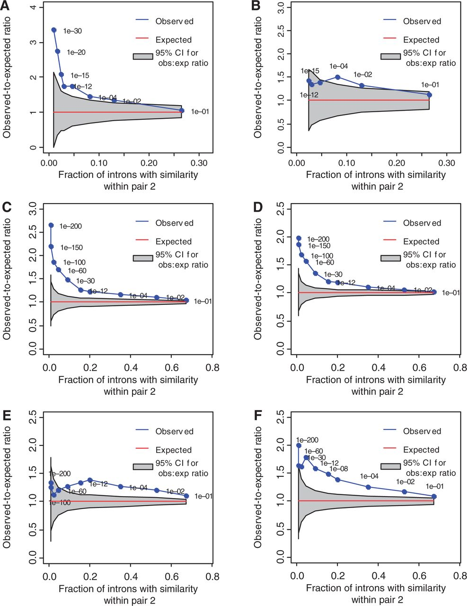
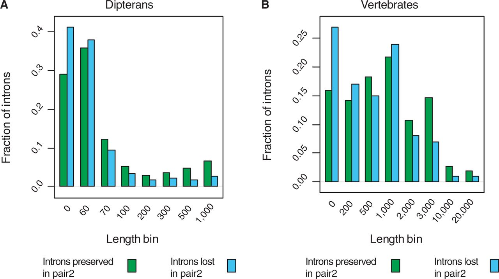

Genome-Level Analysis of Selective Constraint without Apparent Sequence Conservation
=====================================================================================

Full Citation
-------------
Vakhrusheva, O. A, Bazykin, G. A, & Kondrashov, A. S. (2013). *Genome-level analysis of selective constraint without apparent sequence conservation*. **Genome biology and evolution**, 5(3), 532–541. doi:10.1093/gbe/evt023

Links: `PubMed <http://www.ncbi.nlm.nih.gov/pubmed/23418180>`_ -- `Full Text (PDF) <http://gbe.oxfordjournals.org/content/5/3/532.full.pdf+html>`_ -- `Full Text (HTML)  <http://gbe.oxfordjournals.org/content/5/3/532.full>`_

`License information pertaining to the original article`_

Elevator Speech
---------------

Academic Significance
^^^^^^^^^^^^^^^^^^^^^^^^^^^^^^^^
Other studies have demonstrated individual instances of conservation of sequence elements that are no longer **globally alignable** due to extended phylogenetic divergence.  Familiar examples include the demonstration that some transgenic enhancer regions from orthologous genes in distantly related species are able to drive correct gene expression of the host species even though **global alignment** of the enhancer regions was impossible.

However the authors claim that this is the first genome-scale study they know of that supports the phenomena of selective constraint acting on sequence elements absent of identifiable sequence conservation.

.. note:: By terms like 'identifiable sequence conservation', they really seem to be referring to the ability to generate meaningful **global alignment** since they plainly use **local alignment** to identity the sequences they propose are being selectively retained.

Main Hypotheses
^^^^^^^^^^^^^^^^^
:math:`H_1`: the presence of a 'conserved' segment between two less divergent species should *overall* predict the presence of corresponding conserved segments in a separate pair of similarly divergent species that together have a much larger pair-to-pair divergence distance (see :ref:`f1` for graphical representation). **[relevant figures:** :ref:`f2` **]**

:math:`H_2`: if *empirically validated* regulatory elements persist longer than the sequence similarity of the corresponding DNA segments, introns containing a regulatory element in pair 1 should carry a corresponding segment in pair 2 at rates higher than expected by chance. **[relevant figures:** :ref:`f3` **]**

:math:`H_3`: presence of a functional element in an orthologous intron in one species pair should correlate with a reduced instance of intron loss when compared to an outgroup serving as a way to infer the presence/absence of the functional element in a distant common ancestor. **[relevant figures:** :ref:`f4` **]**

:math:`H_4`: because others have already established that longer introns are more likely to carry a segment of conservation than short introns, a function conserved in all four species should be expected to be associated with larger intron length  when conserved in pair 1 *and* pair 2, compared with the introns lost in pair 2. **[relevant figures:** :ref:`f5` **]**

.. more::

|

''''''''''''''''''

|

Highlights by Section
---------------------

Introduction
^^^^^^^^^^^^^^^
- Conservation of function is usually perceived to be associated with conservation of sequence (the main discovery process for orthologous genes is centered on sequence similarity even)
- As far as I can tell, when they say "sequence conservation" they mean successful sequence alignment across genomes 
- This coupling of function with primary sequence conservation is not strictly required. Examples given:
	- unalignable proteins can have very similar 3D structures (and even active site locations)
	- single stranded RNA molecules can form identical structures regardless of alignability
	- unalignable enhancers from mice can correctly drive gene expression in zebra fish
 

|

''''''''''''''''''

|

Materials and Methods
^^^^^^^^^^^^^^^^^^^^^^
Data
~~~~~

- two sets of species quartets were chosen (one dipteran and one vertebrate quartet)
- each quartet represents a basic evolutionary structure characterized by two species couplets and an outgroup
- each couplet shows less evolutionary divergence between the species than exists between the two couplet groups of each quartet (see :ref:`f1`)
- orthologs for all species were obtained from the `INPARANOID <http://inparanoid.sbc.su.se/cgi-bin/index.cgi>`_ web resource

.. note:: The following was a bit tricky at first reading:
	
	It seems there were two classes of analyses performed. The first with just the four experimental species (what level of 'conservation' of small local similarity exists between and within the couplets of the two quartets), and one to assess cases of intron loss which required use of the outgroup.

- ortholog inclusion depended on several criteria including but not limited to:
	- all four or five species contain a version of the ortholog
	- no ortholog set was allowed to have any member contain a premature stop codon
- the resulting ortholog set sizes were:

===========   ============  =======================
Quartet       Experimental  Plus Outgroup
===========   ============  =======================
dipterans     5,183         3,541
vertebrates   8,159         2,518
===========   ============  =======================

|
|

.. note::
	evolutionary divergence is defined here as the amount of expected synonymous substitutions per site in each species (:math:`Ks`)

|
|

.. _f1:
.. figure:: F1.large.jpg
	:width: 600px
	:align: center
	
	**Figure 1** 
	
	*Two quartets of species used in the analysis, of 1) dipterans and 2) vertebrates, together with the corresponding outgroup species. Evolutionary distances within each pair of species, characterized by the estimated per site number of synonymous substitutions Ks, are presented.*

|

''''''''''''''''''

|

Identification and Analysis of Orthologous Introns
~~~~~~~~~~~~~~~~~~~~~~~~~~~~~~~~~~~~~~~~~~~~~~~~~~

.. note:: orthologous introns here **very basically** means that the introns share the same flanking exons in all the species

- a series of filters were applied to all the introns of the orthologous genes from each quartet
- the purpose of the filters were to focus on introns that were least likely to have conserved sequence (**by alignability**) while most likely to actually share common ancestry.
- the final useful intron counts were:
	- dipterans: 5,367
	- vertebrates: 51,844

|

''''''''''''''''''

|

Calculation of Expected Number of Introns Carrying a Segment of Similarity within Both Pairs
~~~~~~~~~~~~~~~~~~~~~~~~~~~~~~~~~~~~~~~~~~~~~~~~~~~~~~~~~~~~~~~~~~~~~~~~~~~~~~~~~~~~~~~~~~~~~

.. topic:: General Procedure 

	1. Orthologous introns in each species pair are blasted against each other looking for regions of **local alignment** 

	2. Definition of successful **local alignment** are set by using progressively more stringent E-value thresholds

	3. For each E-vale threshold: the number of orthologous introns producing successful **local alignments** are tallied

	4. To determine the number of *expected* successful **local alignments**, the data are randomly shuffled 10,000 times

	5. Four different shuffling methods for generating the *expected* successful **local alignments** were employed

+------------------------------------------------------+-------------+
|         Shuffling Methods                            |  Figure     |
+======================================================+=============+
| no accounting for confounding factors                |   S1        |
+------------------------------------------------------+-------------+
| accounting for intron length                         |    2        |
+------------------------------------------------------+-------------+
| accounting for gene identity                         |   S3        |
+------------------------------------------------------+-------------+
| accounting for gene identity **and** intron order    |    S4       |
+------------------------------------------------------+-------------+
	

|

''''''''''''''''''

|

Analysis of Data on Chromatin Modifications
~~~~~~~~~~~~~~~~~~~~~~~~~~~~~~~~~~~~~~~~~~~

Because so far the idea of 'functional' has been simply inferred on the basis of coincidental inclusion of similar local sequence identity, the authors attempt to harvest experimentally validated functional regions from *Homo sapiens* and *Drosophila melanogaster* using the `ENCODE <http://genome.ucsc.edu/ENCODE/>`_ and `modENCODE <http://www.modencode.org/>`_ projects data.

For humans they focus on relevant strong enhancers (states 4 and 5) or insulators (state 8).  For flies they focus on enhancers (state 3) or 'active introns' (state 4).

|

''''''''''''''''''

|

Identification of Intron Losses
~~~~~~~~~~~~~~~~~~~~~~~~~~~~~~~~~~~~~~~~~~~
Direct quote:

	For the third and the fourth tests, to trace the losses of introns on the phylogeny, the tree corresponding to each species quartet was rooted with an outgroup species ([:ref:`f1`]). We then selected introns present in both species from pair 1 and in the outgroup species, assuming that such introns were present in the last common ancestor of both considered species pairs. Again, orthologous introns with significant similarity (bl2seq E-value ≤ 0.0001) between sequences from different pairs were excluded from analysis. These introns were then subdivided into 1) those also present in both pair 2 species and 2) those that had been lost in at least one of the pair 2 species. (Introns absent in one of the pair 2 species were usually also absent in the other, implying loss on the branch separating pair 2 from its common ancestor with pair 1; cases of intron loss mapping to external branches were rare.) For groups of introns indicated in 1) and 2), we compared the distributions of E-values within pair 1, and the distributions of intron lengths within pair 1. Reciprocal tests were performed analogously.

|

''''''''''''''''''

|

Results and Discussion
^^^^^^^^^^^^^^^^^^^^^^
.. _f2:

	
	**Figure 2** 
	
	*Introns that carry a segment of high similarity between species of one pair are more likely to also carry a segment of high similarity between species of the other pair within a quartet. Each blue dot corresponds to a specific BLAST E-value (shown next to the dot), with lower values corresponding to more stringent similarity thresholds. Each E-value was used to detect similar segments within orthologous introns of the two species belonging to pair 1, and of the two species belonging to pair 2. Horizontal axis, fraction of introns that carry similar segments within pair 1, among introns present in all four species. Vertical axis, number (A, B) or observed-to-expected ratio (C, D) for the number of introns that carry similar segments both within pair 1 and 2. Top, dipterans; bottom, vertebrates. Observed-to-expected ratio was defined as the ratio of the observed number of introns with similarity within both pairs to the expected number if the segments of similarity were distributed randomly over all introns, controlling for intron lengths (see text). The red line and the gray area correspond to the mean and 95% confidence intervals for the expected values calculated in 10,000 resampling trials.*

|

''''''''''''''''''

|

.. _f3:

	
	**Figure 3** 
	
	*Introns that carry a segment of similarity in pair 2 are more likely to overlap regulation-associated elements within pair 1. Each blue dot corresponds to a specific BLAST E-value (shown next to the dot). Each E-value was used to detect similar segments within orthologous introns of the two species belonging to pair 2. Horizontal axis, fraction of introns that carry similar segments within pair 2, among introns present in all four species. Vertical axis, observed-to-expected ratio for the number of introns that carry a regulation-associated element within pair 1, according to modENCODE (Kharchenko et al. 2010; Roy et al. 2010) (A, B) or ENCODE (ENCODE Project Consortium 2004; Ernst et al. 2011) (C–F) data, and also carry a segment of similarity within pair 2. (A, B) Dipterans; (C–F) vertebrates. (A) Active introns, any cell line; (B) enhancers, any cell line; (C) insulators, all adult cell lines; (D) insulators, both embryonic cell lines; (E) strong enhancers, all adult cell lines; (F) strong enhancers, both embryonic cell lines. Observed-to-expected ratio was defined as the ratio of the observed number of introns with a regulation-associated element within pair 1 and similarity within pair 2 to the same number expected if the regulation-associated elements and the segments of similarity were distributed randomly over all introns, controlling for intron lengths. The red line and the gray area correspond to the mean and 95% confidence intervals for the expected values calculated in 10,000 resampling trials.*

|

''''''''''''''''''

|

.. _f4:
.. figure:: F4.large.jpg
	:width: 600px
	:align: center
	
	**Figure 4** 
	
	*Introns preserved in both pair 2 species are more likely to carry a conserved segment within pair 1. For each quartet, the distribution of E-values within pair 1 are shown for introns preserved in both pair 2 species (green), and for introns lost in at least one of the pair 2 species (blue). E-values indicated below the horizontal axis correspond to the lower E-value threshold. Insets show the fraction of introns with at least a marginal (E-value ≤ 1) similarity observed, for the same two groups.*

|

''''''''''''''''''

|

.. _f5:

	
	**Figure 5** 
	
	*Introns preserved in both pair 2 species tend to be longer within pair 1 species. For each quartet, the distribution of lengths within pair 1 are shown for introns preserved in both pair 2 species (green), and for introns lost in at least one of the pair 2 species (blue). Lengths indicated below the horizontal axis correspond to the lower length threshold. The length of the shorter of the two orthologous introns in pair 1 was used.*

License information pertaining to the original article
-------------------------------------------------------
Unless otherwise noted, all figures and text in the captions are the work of the original authors.  I claim no authorship to these whatsoever. The research was originally licensed and `distributed under the terms of the Creative Commons Attribution Non-Commercial License (http://creativecommons.org/licenses/by-nc/3.0/), which permits unrestricted non-commercial use, distribution, and reproduction in any medium, provided the original work is properly cited. <http://www.oxfordjournals.org/our_journals/gbe/terms.html>`_

.. author:: default
.. categories:: Journal Club, Journal Club (shorts)
.. tags:: Research Blogging, evolution, selection, conservation, genomics, sequence analysis
.. comments::
