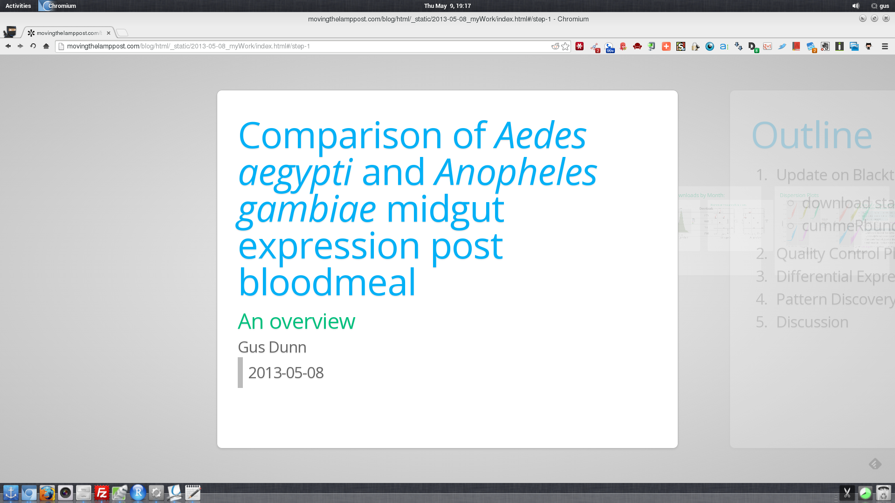

Comparison of *Aedes* *aegypti* and *Anopheles* *gambiae* midgut gene expression post bloodmeal: an overview
====================================================================================================================

.. more::

Introduction to New Post Category: My Presentations
----------------------------------------------------
This is my first post in a new category of posts called "My Presentations" which shockingly will consist of as many of my talks that I am able to share online.
It will most likely only contain talks that I write going forward since most of my other talks are not in 'website' form, and I do not have time to convert them.

However, I recently discovered an approach to writing presentations that is pretty similar to how I write this blog (in `ReST <http://docutils.sourceforge.net/rst.html>`_ or `Markdown <http://daringfireball.net/projects/markdown/>`_ then conversion to HTML and JavaScript with a special tool: `Tinkerer <http://www.tinkerer.me/>`_ for this blog and `mdpress <https://github.com/egonSchiele/mdpress>`_ for the presentations).
Therefore the resulting presentations are webpages and easily shareable!
Yay `Open Science <http://opensciencefederation.com/>`_!

So far I REALLY like the presentations it produces, but it **IS** a little flashy, and I have found some differences in how it is displayed depending on the browser being used (so sorry if it sucks for you).
The underlying technology behind the presentations is a combination of JavaScript and CSS3.
Specifically, an engine written by `Bartek Szopka <https://github.com/bartaz>`_ (hereafter referred to as his `GitHub <http://github.com>`_/coder handle: bartaz) called `impress.js <https://github.com/bartaz/impress.js>`_.
Here is his `introduction to it <http://bartaz.github.io/impress.js>`_, written **in** it.

However, beware! 
In its native form, you write your whole presentation in HTML and CSS.
It is not for folks that are looking for a flashier version of powerpoint.
That's where mdpress comes in (THANK GOD).
`Aditya Bhargava <https://github.com/egonSchiele>`_ wrote mdpress and it is awesome. 

I write my presentation **mostly** in markdown (certain more complicated things require jumping into HTML and/or editing the CSS style-sheets), and mdpress reads my markdown file and writes the HTML code for me.
Also, as you saw if you played with his introduction, *which you should*, you might easily get carried away and end up distracting your audience at best, or nauseating them if you are not careful.

	With great power comes great responsibility
	
	\-- Uncle Ben to Peter Parker (*Spiderman*)

Anyway, enough introduction.

Presentation Background
-------------------------------
This is a talk I gave to my lab yesterday at our weekly lab meeting.
It represents my effort to update the group on my projects and provides an opportunity for lab-mates to ask questions, give comments and advice, etc.
This data is part of my dissertation project (which really should get its own full introduction post soon...).
Here is a bit of context.

These are preliminary :term:`RNA-seq` results from an effort I am undergoing to characterize the degree to which conservation of the regulation of bloodmeal triggered gene expression may be described across the ~150 million year divergence time between the last common ancestor of my subject species (*Anopheles gambiae,* *Anopheles stephensi*, *Aedes aegypti*, and *Culex quinquefasciatus*).

.. figure:: http://www.pnas.org/content/106/9/3053/F1.large.jpg
	:width: 400px
	:align: center
	
	Figure 1 from `(Sieglaff et al. PNAS. 2009) <http://www.pnas.org/content/106/9/3053/F1.expansion.html>`_

The talk also served as a way for me to introduce them to the analyses and plots generated by `cummeRbund <http://compbio.mit.edu/cummeRbund/>`_ that I have integrated into my development version of `Blacktie <https://github.com/xguse/blacktie>`_ my automated `Tophat <http://tophat.cbcb.umd.edu/>`_/`Cufflinks <http://cufflinks.cbcb.umd.edu/>`_/`cummeRbund <http://compbio.mit.edu/cummeRbund/>`_ RNA-seq analysis pipeline.

.. author:: default
.. categories:: My Research, My Presentations
.. tags:: RNA-seq, blacktie, cummeRbund, open science, NGS
.. comments::
