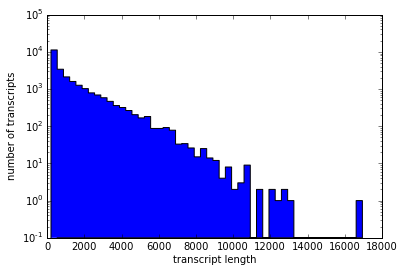
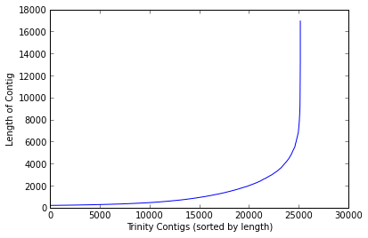
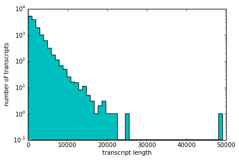
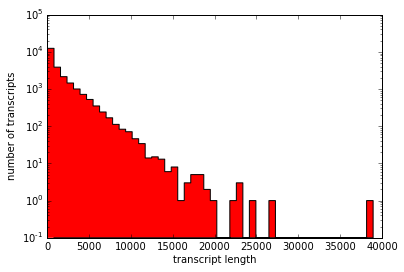
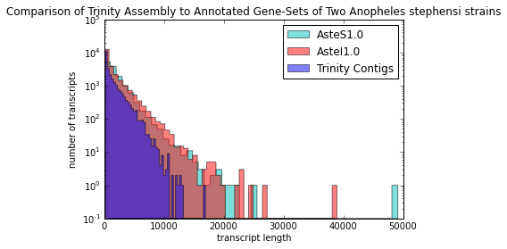
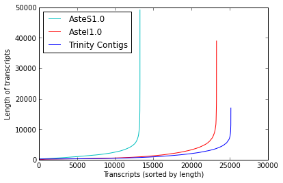

First pass Trinity Results for Anopheles stephensi midgut RNA-seq (non-bloodfed)
================================================================================

.. attention::
	I have updated this post.  

Exploration of the first set of results from a Trinity run with default settings on one library of Anopheles stephensi midgut RNA-seq (As\_00 lib one)
**********************************************************************************************************************************************************

Analyze Lengths Of Assembled Contigs/Transcripts
------------------------------------------------

Count all transcripts of length *X*:

In[1]:

.. code:: python

    from collections import defaultdict
    from rSeq.utils.files import ParseFastA
    
    def measure_and_count_transcripts(fasta_path):
        
        tx_lens = defaultdict(list)
        
        p = ParseFastA(fasta_path)
        seqs = p.to_dict()
        
        for name,seq in seqs.iteritems():
            tx_lens[len(seq)].append(name)
                
        print "The number of different transcript sizes encountered: %s" % (len(tx_lens))
        return tx_lens

Now I will plot the size data in a number of different ways.

In[2]:

.. code:: python

    # Prep to plot a Histogram of the numbers of transcripts in each length bin
    
    trinity_tx_lens = measure_and_count_transcripts('/home/gus/Dropbox/common/projects/trinity_As/trinity_As_00_0_test/Trinity.fasta')
    
    trinity_lengths = []
    
    for item in trinity_tx_lens.iteritems():
        trinity_lengths.extend([item[0]] * len(item[1]))
    
    trinity_lengths.sort()

.. parsed-literal::

    The number of different transcript sizes encountered: 4632

In[3]:

.. code:: python

    hist(trinity_lengths, bins=50, histtype='stepfilled',log=1)
    xlabel('transcript length')
    ylabel('number of transcripts')

.. parsed-literal::

    <matplotlib.text.Text at 0x3ecb2d0>

In[4]:

.. code:: python

    plot(trinity_lengths)
    xlabel('Trinity Contigs (sorted by length)')
    ylabel('Length of Contig')

.. parsed-literal::

    <matplotlib.text.Text at 0x2ad3290>

Now I calculate the N50_length and N50_index for the trinity assembly.

**N50_index:** the number of largest contigs(transcripts) whose summed
lengths equal at least 50% of the sum of **ALL** contigs (smaller
numbers are 'better')

**N50_length:** the length of the last added contig from above (larger
numbers are 'better')

In[5]:

.. code:: python

    def calc_N50s(lengths):
        total_length = sum(lengths)
        print "total_length:\t\t%s" % (total_length)
        
        running_total = 0
        collected_lengths = []
        n50_i = None
        
        for length in reversed(lengths): 
            running_total += length
            collected_lengths.append(length)
            
            if running_total >= total_length * 0.5:
                n50_i = len(collected_lengths)
                n50_l = length
                break
        
        print "running_total:\t\t%s" % (running_total) 
        print "N50_index:\t\t%s of %s" % (n50_i,len(lengths))
        print "N50_length:\t\t%s" % (n50_l)
        print "median contig length\t%s" % (median(lengths))

In[6]:

.. code:: python

    calc_N50s(trinity_lengths)

.. parsed-literal::

    total_length:		31858558
    running_total:		15931068
    N50_index:			3927 of 25167
    N50_length:			2469
    median contig length	647.0
    
    
.. more::

Analyze Lengths Of Predicted Transcripts
----------------------------------------

1. AsteS1.0
~~~~~~~~~~~

In[7]:

.. code:: python

    asteS1_0_tx_lengths = measure_and_count_transcripts('/home/gus/genome_data/AsteS/Anopheles-stephensi-SDA-500_TRANSCRIPTS_AsteS1.0.fa')
    
    asteS1_0_lengths = []
    
    for item in asteS1_0_tx_lengths.iteritems():
        asteS1_0_lengths.extend([item[0]] * len(item[1]))
    
    asteS1_0_lengths.sort()

.. parsed-literal::

    The number of different transcript sizes encountered: 4058

In[8]:

.. code:: python

    hist(asteS1_0_lengths, bins=50, histtype='stepfilled',color='c', log=1)
    xlabel('transcript length')
    ylabel('number of transcripts')

.. parsed-literal::

    <matplotlib.text.Text at 0x4e6e0d0>

In[9]:

.. code:: python

    plot(range(len(asteS1_0_lengths)), asteS1_0_lengths, color='c')
    xlabel('SDA-500 strain gene-build AsteS1.0 transcripts (sorted by length)')
    ylabel('Length of transcripts')

.. parsed-literal::

    <matplotlib.text.Text at 0x50f9d10>

.. image:: _fig_14.png

In[10]:

.. code:: python

    calc_N50s(asteS1_0_lengths)

.. parsed-literal::

    total_length:		25155329
    running_total:		12580251
    N50_index:			2617 of 13251
    N50_length:			2838
    median contig length	1344.0

2. AsteI1.0
~~~~~~~~~~~

In[11]:

.. code:: python

    asteI1_0_tx_lengths = measure_and_count_transcripts('/home/gus/genome_data/AsteI/Anopheles-stephensi-Indian_TRANSCRIPTS_AsteI1.0.fa')
    
    asteI1_0_lengths = []
    
    for item in asteI1_0_tx_lengths.iteritems():
        asteI1_0_lengths.extend([item[0]] * len(item[1]))
    
    asteI1_0_lengths.sort()

.. parsed-literal::

    The number of different transcript sizes encountered: 5227

In[12]:

.. code:: python

    hist(asteI1_0_lengths, bins=50, histtype='stepfilled',color='r', log=1)
    xlabel('transcript length')
    ylabel('number of transcripts')

.. parsed-literal::

    <matplotlib.text.Text at 0x5238450>

In[13]:

.. code:: python

    plot(range(len(asteI1_0_lengths)),asteI1_0_lengths, color='r')
    xlabel('Indian strain gene-build AsteI1.0 transcripts (sorted by length)')
    ylabel('Length of transcripts')

.. parsed-literal::

    <matplotlib.text.Text at 0x55e1350>

.. image:: _fig_22.png

In[14]:

.. code:: python

    calc_N50s(asteI1_0_lengths)

.. parsed-literal::

    total_length:		35859205
    running_total:		17930131
    N50_index:			3231 of 23287
    N50_length:			3279
    median contig length	717.0

Combined Figures
~~~~~~~~~~~~~~~~

In[15]:

.. code:: python

    hist(asteS1_0_lengths, bins=50, histtype='stepfilled',color='c', log=1, alpha=0.5, label='AsteS1.0')
    hist(asteI1_0_lengths, bins=50, histtype='stepfilled',color='r', log=1, alpha=0.5, label='AsteI1.0')
    hist(trinity_lengths, bins=50, histtype='stepfilled', color='b', log=1, alpha=0.5, label='Trinity Contigs')
    xlabel('transcript length')
    ylabel('number of transcripts')
    title('Comparison of Trinity Assembly to Annotated Gene-Sets of Two Anopheles stephensi strains')
    legend()

.. parsed-literal::

    <matplotlib.legend.Legend at 0x6308550>

In[16]:

.. code:: python

    plot(range(len(asteS1_0_lengths)), asteS1_0_lengths, color='c', label='AsteS1.0')
    plot(range(len(asteI1_0_lengths)), asteI1_0_lengths, color='r', label='AsteI1.0')
    plot(range(len(trinity_lengths)),  trinity_lengths,  color='b', label='Trinity Contigs')
    xlabel('Transcripts (sorted by length)')
    ylabel('Length of transcripts')
    legend(loc=0)
    
    print "\n'Transcript/Contig' numbers per data-set:\n"
    print "AsteS1.0\t%s" % len(asteS1_0_lengths)
    print "AsteI1.0\t%s" % len(asteI1_0_lengths)
    print "Trinity\t\t%s" % len(trinity_lengths)
    print ''

.. parsed-literal::

    
    'Transcript/Contig' numbers per data-set:
    
    AsteS1.0	13251
    AsteI1.0	23287
    Trinity	25167
    

Observations:
~~~~~~~~~~~~~

-  Trinity assembly represents only one tissue in one life-stage so it
   may be expected to be an under-representation of the total possible
   transcriptome

   -  however, that is **NOT** what is seen.

-  This may indicate, unsurprisingly, that the assembly contains many
   incomplete and/or incorrect transcript/contigs.

   -  perhaps due to one or more of:

      1. ``Trinity`` settings used (kmer size, etc)
      2. insufficient read coverage
      3. RNA quality
      4. Incomplete/other problems with annotation of gene-sets (both
         are *pre*-version 1)

         -  but unlikely to cause such large differences as AsteS1 to
            Trinity.

      5. one idea I wont talk about, that VanMac may be interested in.

Next Steps:
~~~~~~~~~~~

1. re-run with full single-stage fastq complement (*in progress*
   2013-07-05)
2. run Blat on ``Trinity`` assembly and AsteI and AsteS transcripts to
   compare

   -  coverage of respective genome assemblies
   -  overall alignment qualities

      -  help us better understand our strain's relationship to the
         published strains

   -  agreement with published gene-sets

3. repeat process after completing step 1 with all time-points

.. author:: default
.. categories:: My Research
.. tags:: RNA-seq, de novo transcriptome assembly, Trinity, Anopheles stephensi, midgut, non-bloodfed, blood feeding, ipython, python
.. comments::
