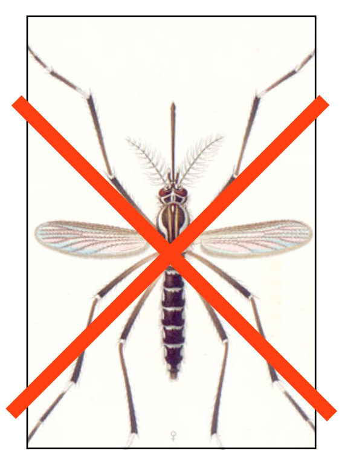

Elements of transgenic disease-vector control (Part 2: altering the mosquitoes)
===============================================================================

.. _four-fundamentals-of-transgenic-vector-control:

The four fundamentals of transgenic vector control
--------------------------------------------------
1. the ability to introduce :term:`transgenes <transgene>` into the mosquito's genome in a heritable way
2. discovery or construction effector genes
3. the ability to control when and where the :term:`effector genes <effector gene>` are activated 
4. the ability of your transgenic mosquitoes to have **swift**, dramatic, and clinically meaningful effects on the native vector population

.. author:: default
.. categories:: My Research
.. tags:: mosquitoes, background, vector control, transgenic mosquitoes, GMO, GMM, my research
.. comments::